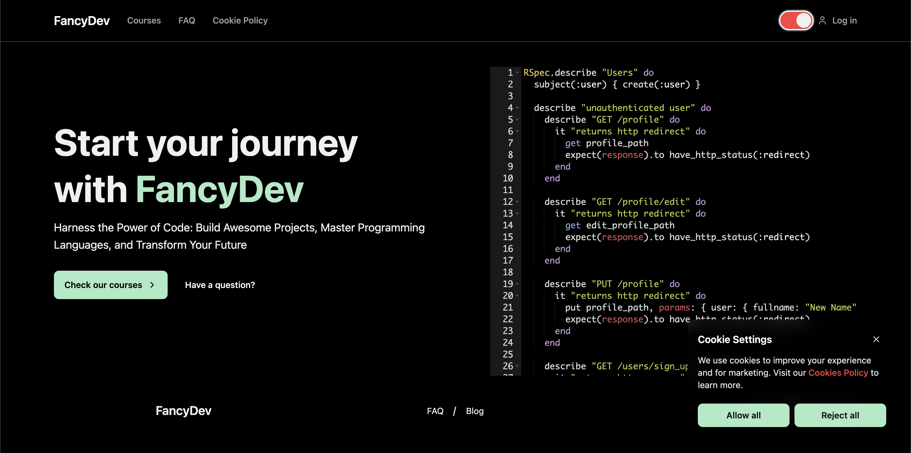

[![Contributors][contributors-shield]][contributors-url]
[![Forks][forks-shield]][forks-url]
[![Stargazers][stars-shield]][stars-url]
[![Issues][issues-shield]][issues-url]
[![LinkedIn][linkedin-shield]][linkedin-url]
<!-- [![MIT License][license-shield]][license-url] -->

# About The Project

Welcome to our open-source eLearning platform—a collaborative space for creating and sharing engaging courses. Whether you're a seasoned instructor or a passionate subject matter expert, our user-friendly interface and versatile features empower you to craft interactive and comprehensive learning experiences. Join us in shaping the future of online education and fostering a global community of lifelong learners.

## Built With

[![Ruby][Ruby]][Ruby-url]
[![Ruby-on-rails][Ruby-on-rails]][Ruby-on-rails-url]
[![Hotwire][Hotwire]][Hotwire-url]
[![Nodejs][Nodejs]][Nodejs-url]
[![Typescript][Typescript]][Typescript-url]
[![Tailwind][Tailwind]][Tailwind-url]
[![Daisy][Daisy]][Daisy-url]
[![Docker][Docker]][Docker-url]

## Setup

1. Pull down the app from version control
2. `docker-compose up`
3. `docker-compose run --rm web bin/setup`

## Running The App

1. `docker-compose up`

## Tests and CI

1. `docker-compose run --rm web bin/ci`

## Production

* All runtime configuration should be supplied
in the UNIX environment

<!-- MARKDOWN LINKS & IMAGES -->
[contributors-shield]: https://img.shields.io/github/contributors/PatRogala/elearning-platform.svg?style=for-the-badge
[contributors-url]: https://github.com/PatRogala/elearning-platform/graphs/contributors
[forks-shield]: https://img.shields.io/github/forks/PatRogala/elearning-platform.svg?style=for-the-badge
[forks-url]: https://github.com/PatRogala/elearning-platform/network/members
[stars-shield]: https://img.shields.io/github/stars/PatRogala/elearning-platform.svg?style=for-the-badge
[stars-url]: https://github.com/PatRogala/elearning-platform/stargazers
[issues-shield]: https://img.shields.io/github/issues/PatRogala/elearning-platform.svg?style=for-the-badge
[issues-url]: https://github.com/PatRogala/elearning-platform/issues
<!-- [license-shield]: https://img.shields.io/github/license/PatRogala/elearning-platform.svg?style=for-the-badge
[license-url]: https://github.com/PatRogala/elearning-platform/blob/master/LICENSE.txt -->
[linkedin-shield]: https://img.shields.io/badge/-LinkedIn-black.svg?style=for-the-badge&logo=linkedin&colorB=555
[linkedin-url]: https://linkedin.com/in/patrogala
[product-screenshot]: preview.png
[Ruby]: https://img.shields.io/badge/Ruby_3-D51F06?style=for-the-badge&logo=ruby&logoColor=white
[Ruby-url]: https://www.ruby-lang.org/en/
[Ruby-on-rails]: https://img.shields.io/badge/Rails_7-cc0000?style=for-the-badge&logo=RubyOnRails&logoColor=white
[Ruby-on-rails-url]: https://rubyonrails.org/
[Tailwind]: https://img.shields.io/badge/Tailwind-06b6d4?style=for-the-badge&logo=Tailwindcss&logoColor=white
[Tailwind-url]: https://tailwindcss.com/
[Typescript]: https://img.shields.io/badge/Typescript-007acc?style=for-the-badge&logo=Typescript&logoColor=white
[Typescript-url]: https://www.typescriptlang.org
[Nodejs]: https://img.shields.io/badge/Node.js_20-3c873a?style=for-the-badge&logo=Node.js&logoColor=white
[Nodejs-url]: https://nodejs.org/en
[Docker]: https://img.shields.io/badge/Docker-0db7ed?style=for-the-badge&logo=Docker&logoColor=white
[Docker-url]: https://www.docker.com
[Hotwire]: https://img.shields.io/badge/Turbo-5CD8E5?style=for-the-badge&logo=Turbo&logoColor=black
[Hotwire-url]: https://turbo.hotwire.dev/
[Daisy]: https://img.shields.io/badge/DaisyUI-5A0EF8?style=for-the-badge&logo=DaisyUI&logoColor=white
[Daisy-url]: https://daisyui.com
